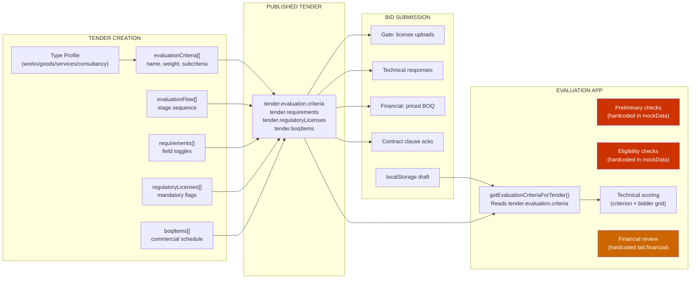

# ProcureX Evaluation App — Deep Analysis and Improvements

> [!NOTE]
> Full audit of [bid-evaluation.js](file:///c:/Users/ADMIN/Downloads/proc%20system/procurex-ui/pages/bid-evaluation.js) (1,286 lines) tracing the data pipeline from tender creation → bid submission → evaluation.

---

## 1. End-to-End Data Pipeline



---

## 2. Critical Disconnects Found

### 🔴 The Core Problem: Evaluation Ignores What Was Actually Created and Submitted

The tender creation wizard produces rich, type-specific data:
- **Works**: BOQ, methodology requirements, key personnel, equipment, OSHA compliance
- **Goods**: Quantity schedule, spec compliance, delivery terms, warranty
- **Services**: SLA schedule, staffing plan, KPIs
- **Consultancy**: TOR, methodology, key expert CVs, financial proposal

But the evaluation app **does not read any of this**. Here's what each stage actually uses:

| Evaluation Stage | Expected Data Source | Actual Data Source | Gap |
|---|---|---|---|
| **Preliminary** | Tender `submissionDocuments[]` + `requirements{}` | `mockData.bidEvaluation.bids[].preliminaryChecks[]` — **hardcoded** | 🔴 Checks don't come from the tender |
| **Eligibility** | Tender `regulatoryLicenses[]` + verification data | `mockData.bidEvaluation.bids[].eligibilityChecks[]` — **hardcoded** | 🔴 Ignores tender license requirements |
| **Technical Criteria** | Tender `evaluation.criteria[]` with weights and subcriteria | `tender.evaluation.criteria` OR `mockData.bidEvaluation.technicalCriteria[]` fallback | 🟡 Works when tender was published; falls back to generic |
| **Financial** | Submitted BOQ pricing vs tender BOQ | `mockData.bidEvaluation.bids[].financial{}` — **hardcoded** | 🔴 No line-by-line BOQ comparison |
| **Bid Document View** | Actual submitted bid from localStorage | `getProcurexSubmittedBidsForTender()` — **same-browser only** | 🔴 Cross-browser fails |

> [!CAUTION]
> **The preliminary and eligibility stages are completely decorative.** They display pre-written Pass/Fail results from `mockData` regardless of what the tender actually required or what the bidder actually submitted. An evaluator cannot add, remove, or modify checklist items.

---

## 3. How It Should Work (Tender → Evaluation Mapping)

### 3.1 Preliminary Evaluation Should Be Auto-Generated From Tender

**Current**: Hardcoded 4 checks per bidder (same for all tenders).

**Proposed**: Auto-generate checklist from the published tender:

```javascript
function generatePreliminaryChecklist(tender) {
    const checks = [
        { requirement: 'Bid submitted before deadline', source: 'system' },
        { requirement: 'All mandatory forms submitted', source: 'system' }
    ];
    // From tender.requirements — e.g., if bidSecurityRequired is true
    if (tender.requirements?.fields?.bidSecurityRequired) {
        checks.push({ requirement: 'Bid security submitted', source: 'tender.requirements' });
    }
    // From tender.requiredSubmissionDocuments[]
    (tender.requiredSubmissionDocuments || []).forEach(doc => {
        checks.push({ requirement: `${doc} submitted`, source: 'tender.requiredSubmissionDocuments' });
    });
    return checks;
}
```

### 3.2 Eligibility Should Map From Tender Regulatory Licenses

**Current**: Hardcoded 4 eligibility items per bidder.

**Proposed**: Generate from `tender.regulatoryLicenses[]`:

```javascript
function generateEligibilityChecklist(tender) {
    const checks = [
        { requirement: 'Company registration', source: 'standard' }
    ];
    (tender.regulatoryLicenses || []).forEach(license => {
        checks.push({
            requirement: license.license,
            mandatory: license.mandatory,
            expiryRequired: license.expiryRequired,
            source: 'tender.regulatoryLicenses'
        });
    });
    return checks;
}
```

### 3.3 Technical Scoring Should Show Bid Responses Against Criteria

**Current**: The evaluator sees criteria names and subcriteria text, but has **no view of what the bidder actually wrote**. The bid document is shown as a separate collapsed panel — the evaluator must scroll between the bid and the scoring form.

**Proposed**: Side-by-side layout per criterion:

```
┌──────────────────────┬──────────────────────┐
│ CRITERION: Methodology│ BIDDER: ABC Ltd       │
│ Weight: 30%           │                       │
│                       │ BIDDER'S RESPONSE:    │
│ Subcriteria:          │ "Our methodology      │
│ • Construction        │  follows a 4-phase    │
│   approach            │  approach..."         │
│ • Quality controls    │                       │
│ • Sequencing plan     │ UPLOADED: method.pdf  │
│                       │ BOQ SECTION: 1.1-1.4  │
├──────────────────────┼──────────────────────┤
│ Score: [  ] / 30      │ Evidence ref: [     ] │
│ Result: [Pass ▼]      │ Comment: [          ] │
└──────────────────────┴──────────────────────┘
```

### 3.4 Financial Evaluation Should Compare Line-by-Line

**Current**: Shows a summary table with quoted price, corrected price, discount. No BOQ comparison.

**Proposed**: Generate a BOQ comparison matrix from `tender.boqItems[]` vs each bidder's priced BOQ:

```
┌──────────────┬──────────┬──────────┬──────────┬──────────┐
│ BOQ Item     │ Buyer Est│ ABC Ltd  │ XYZ Ltd  │ BuildRt  │
├──────────────┼──────────┼──────────┼──────────┼──────────┤
│ Excavation   │ 2.5M     │ 2.3M     │ 2.8M     │ 2.4M     │
│ Concrete     │ 7.2M     │ 7.0M     │ 7.5M     │ 6.9M     │
│ Roofing      │ 4.1M     │ 4.3M     │ 3.9M     │ 4.2M     │
├──────────────┼──────────┼──────────┼──────────┼──────────┤
│ TOTAL        │ 13.8M    │ 13.6M    │ 14.2M    │ 13.5M    │
│ Variance     │  —       │ -1.4%    │ +2.9%    │ -2.2%    │
└──────────────┴──────────┴──────────┴──────────┴──────────┘
```

---

## 4. Missing Features

### 🔴 High Priority

| # | Feature | Why It Matters |
|---|---------|---------------|
| 1 | **Dynamic preliminary checklist from tender** | Currently hardcoded — evaluator can't verify what was actually required |
| 2 | **Dynamic eligibility from regulatory licenses** | Tender defines mandatory licenses, but evaluation ignores them |
| 3 | **Bid response viewer per criterion** | Evaluator scores blindly — cannot see what the bidder wrote for each criterion |
| 4 | **BOQ line-by-line comparison** | Financial evaluation is summary-only — no item-level price comparison |
| 5 | **Pass mark gate enforcement** | `minimumTechnicalPassMark: 70` exists in data but is never enforced — a bidder scoring 45 can still proceed |

### 🟡 Medium Priority

| # | Feature | Why It Matters |
|---|---------|---------------|
| 6 | **Evaluator assignment per criterion** | All criteria go to all evaluators — no task splitting |
| 7 | **Consensus vs individual scoring** | No mode for multiple evaluators to score independently then reconcile |
| 8 | **Score justification requirement** | Comment field exists but is not mandatory — evaluator can score 0 with no explanation |
| 9 | **Document viewer integration** | "View Document" button exists but does nothing |
| 10 | **Evaluation method awareness** | Tender specifies method (QCBS, Least Cost, etc.) but evaluation always uses simple sum+rank |

### 🟢 Low Priority

| # | Feature | Why It Matters |
|---|---------|---------------|
| 11 | **Print-optimized evaluation report** | Report renders without page breaks or headers |
| 12 | **Evaluation timeline/deadline tracking** | No visual indicator of days remaining for evaluation |
| 13 | **Re-evaluation workflow** | No path to re-score if recommendation is returned |

---

## 5. Type-Specific Evaluation Gaps

Each tender type defines a unique `evaluationFlow[]` and `evaluationCriteria[]` during creation. The evaluation app should adapt its stages accordingly:

| Tender Type | Defined Evaluation Flow | Current Evaluation Stages | Gap |
|---|---|---|---|
| **Works** | Admin → Technical → Financial → Post-qualification | Opening → Conflict → Preliminary → Eligibility → Technical → Financial → ... | ⚠️ No "Post-qualification" stage |
| **Goods** | Preliminary → Technical → Financial → Award | Same as above | ✅ Close match |
| **Services** | Technical → Financial → Award | Same as above | ⚠️ Extra preliminary/eligibility stages shown when not needed |
| **Consultancy** | Technical → Financial → Combined ranking | Same as above | 🔴 No QCBS/QBS ranking mechanism |

**Proposed**: Make the stage tabs **dynamic** based on `tender.evaluationFlow[]`:

```javascript
function getEvaluationStagesForTender(tender, defaultStages) {
    const flow = tender?.evaluationFlow || tender?.sourceTender?.evaluationFlow;
    if (!Array.isArray(flow) || !flow.length) return defaultStages;
    
    const stageMap = {
        'Administrative evaluation': { id: 'preliminary', label: 'Administrative' },
        'Preliminary examination': { id: 'preliminary', label: 'Preliminary' },
        'Technical evaluation': { id: 'technical', label: 'Technical' },
        'Financial evaluation': { id: 'financial', label: 'Financial' },
        'Post qualification': { id: 'postqual', label: 'Post-Qualification' },
        'Combined ranking or method-specific selection': { id: 'ranking', label: 'Combined Ranking' },
        'Award recommendation': { id: 'recommendation', label: 'Recommendation' }
    };
    
    return [
        { id: 'overview', label: 'Overview', status: 'current' },
        { id: 'opening', label: 'Bid Opening', status: 'done' },
        { id: 'conflict', label: 'Conflict Declarations', status: 'done' },
        ...flow.map(step => stageMap[step] || { id: slugify(step), label: step }),
        { id: 'report', label: 'Report', status: 'pending' },
        { id: 'audit', label: 'Audit Trail', status: 'active' }
    ];
}
```

---

## 6. Evaluation Method Awareness

The tender `method` field determines HOW scoring should be calculated:

| Method | Current Behavior | Required Behavior |
|---|---|---|
| **Lowest evaluated substantially responsive bid** | Sum technical scores, rank by price | ✅ Current logic approximates this |
| **QCBS (Quality-Cost Based)** | Same as above | 🔴 Should use weighted formula: `Total = (Technical% × T) + (Financial% × F)` |
| **QBS (Quality Based)** | Same as above | 🔴 Financial envelope should only open for top technical scorer |
| **Least Cost** | Same as above | 🔴 Should rank by price among technically qualified bidders only |
| **Fixed Budget** | Same as above | 🔴 Should select highest technical score within budget ceiling |

**Current code** ([bid-evaluation.js:245-252](file:///c:/Users/ADMIN/Downloads/proc%20system/procurex-ui/pages/bid-evaluation.js#L245-L252)):

```javascript
function getEvaluationRecommendedBid(bids, criteria, draft) {
    return bids.slice().sort((a, b) => {
        // Always: highest total score, then lowest price
        const bScore = getEvaluationCriterionTotalForBid(b, criteria, draft);
        const aScore = getEvaluationCriterionTotalForBid(a, criteria, draft);
        if (bScore !== aScore) return bScore - aScore;
        return (a.financial?.correctedPrice || a.price) - (b.financial?.correctedPrice || b.price);
    })[0];
}
```

This **ignores the tender method entirely**. The recommendation logic must branch based on `tender.method`.

---

## 7. Comparison Matrix Improvements

**Current** ([bid-evaluation.js:959-977](file:///c:/Users/ADMIN/Downloads/proc%20system/procurex-ui/pages/bid-evaluation.js#L959-L977)):

Shows 7 rows: Preliminary, Eligibility, Score, Financial, Corrected, Ranking, Recommended.

**Missing rows**:
- Technical pass mark threshold (show pass/fail per bidder)
- Per-criterion score breakdown (not just total)
- Contract clause deviation count
- Submitted document completeness %
- Risk signal summary

**Proposed comparison matrix**:

```
┌──────────────────────┬──────────┬──────────┬──────────┬──────────┐
│                      │ ABC Ltd  │ XYZ Ltd  │ BuildRt  │ Prime    │
├──────────────────────┼──────────┼──────────┼──────────┼──────────┤
│ Preliminary          │ ✅ Pass  │ ✅ Pass  │ ✅ Pass  │ ✅ Pass  │
│ Eligibility          │ ✅       │ ⚠ Clarif │ ✅       │ ✅       │
├──────────────────────┼──────────┼──────────┼──────────┼──────────┤
│ Technical capacity   │ 17/20    │ 15/20    │ 19/20    │ 18/20    │
│ Methodology          │ 25/30    │ 23/30    │ 28/30    │ 26/30    │
│ Key personnel        │ 21/25    │ 19/25    │ 23/25    │ 22/25    │
│ Work plan            │ 13/15    │ 13/15    │ 14/15    │ 14/15    │
│ Quality assurance    │ 9/10     │ 8/10     │ 8/10     │ 8/10     │
├──────────────────────┼──────────┼──────────┼──────────┼──────────┤
│ TECHNICAL TOTAL      │ 85/100   │ 78/100   │ 92/100   │ 88/100   │
│ Pass mark (70)       │ ✅ Pass  │ ✅ Pass  │ ✅ Pass  │ ✅ Pass  │
├──────────────────────┼──────────┼──────────┼──────────┼──────────┤
│ Quoted price         │ 4.80B    │ 4.95B    │ 4.65B    │ 4.75B    │
│ Corrected price      │ 4.81B    │ 4.90B    │ 4.67B    │ 4.75B    │
│ Variance from est.   │ +0.2%    │ +2.3%    │ -2.7%    │ -1.0%    │
│ Risk signal          │ Low      │ Moderate │ Moderate │ Low      │
├──────────────────────┼──────────┼──────────┼──────────┼──────────┤
│ RANKING              │ 3        │ 4        │ ★ 1      │ 2        │
│ Recommended          │ No       │ No       │ ★ Yes    │ No       │
└──────────────────────┴──────────┴──────────┴──────────┴──────────┘
```

---

## 8. Implementation Priority

| Priority | Change | Effort | Impact |
|----------|--------|--------|--------|
| 🔴 P0 | Generate preliminary checklist from `tender.requirements` + `tender.requiredSubmissionDocuments` | Medium | Connects creation to evaluation |
| 🔴 P0 | Generate eligibility checklist from `tender.regulatoryLicenses[]` | Medium | Connects creation to evaluation |
| 🔴 P0 | Show bidder's actual response per criterion (side-by-side layout) | Large | Evaluators can score meaningfully |
| 🔴 P0 | Enforce pass mark gate — block financial stage if bidder fails technical | Small | PPA compliance |
| 🟡 P1 | Add BOQ line-by-line comparison in financial stage | Large | Transparent price evaluation |
| 🟡 P1 | Make evaluation method drive recommendation logic (QCBS/QBS/Least Cost) | Medium | Correct ranking |
| 🟡 P1 | Dynamic stage tabs from `tender.evaluationFlow[]` | Medium | Type-appropriate workflow |
| 🟡 P1 | Expand comparison matrix with per-criterion breakdown | Small | Better decision visibility |
| 🟡 P1 | Make comment mandatory when score < 50% of max | Small | Audit accountability |
| 🟢 P2 | Multi-evaluator scoring with reconciliation | Large | Committee evaluation |
| 🟢 P2 | Evaluation timeline with deadline tracking | Medium | Time management |
| 🟢 P2 | Re-evaluation workflow for returned recommendations | Medium | Approval loop |

---

## 9. Summary

The evaluation app has a **well-structured 11-stage workflow** with draft persistence, bid document viewing, report generation, and audit trail. However, it has **three fundamental disconnects**:

1. **Preliminary and eligibility stages are hardcoded** — they don't read from the tender's actual requirements and regulatory licenses
2. **Technical scoring is blind** — the evaluator cannot see what the bidder wrote for each criterion
3. **Recommendation logic ignores the evaluation method** — QCBS, QBS, Least Cost, and Fixed Budget all use the same simple sum+rank

The highest-impact fix is connecting `tender.requirements` + `tender.regulatoryLicenses` + `tender.evaluation.criteria` to the evaluation checklist generators, so that **what was asked in the tender is exactly what gets evaluated**.
